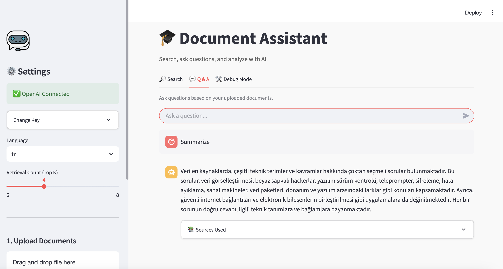

# AI Destekli Doküman Asistanı (AI-Augmented Document Assistant)

Bu proje, **RAG (Retrieval-Augmented Generation)** mimarisini kullanarak belgelerle (PDF, TXT) etkileşime girmenizi sağlayan web tabanlı bir yapay zeka asistanıdır. Kullanıcılar belge yükleyebilir, belgeler içinde anlamsal arama yapabilir ve belge içeriğine dayalı sorular sorabilir.

Ayrıca, sistemin güvenilirliğini test etmek ve proje gereksinimlerini karşılamak amacıyla, yapay zekanın kasıtlı olarak hatalı cevap vermeye zorlandığı özel bir **Debug (Hata Ayıklama)** modu içerir.



## 🚀 Özellikler

*   **Belge Yükleme**: PDF ve TXT dosyalarını destekler.
*   **Anlamsal Arama (Semantic Search)**: Kelime eşleşmesi yerine anlam bazlı arama yapar (OpenAI Embeddings).
*   **Soru & Cevap (Q&A)**: Yüklenen belgelerdeki bilgileri kullanarak soruları yanıtlar ve kaynak gösterir.
*   **Çok Dilli Özetleme**: Belgeleri İngilizce veya Türkçe olarak özetleyebilir.
*   **Kasıtlı Başarısızlık Modu (Intentional Failure Mode)**: Yapay zekanın halüsinasyon görmesini (yanlış bilgi uydurmesini) simüle eden test modu.

---

## 🛠️ Kurulum

Bu projeyi kendi bilgisayarınızda çalıştırmak için aşağıdaki adımları izleyin.

### 1. Gereksinimler
*   Python 3.8 veya üzeri
*   OpenAI API Anahtarı

### 2. Projeyi Klonlayın
```bash
git clone https://github.com/YarenKamber/AI-Augmented-Document-Assistant.git
cd AI-Augmented-Document-Assistant
```

### 3. Sanal Ortam (Virtual Environment) Oluşturma
Bağımlılıkların karışmaması için sanal ortam kullanmanız önerilir.

**Mac/Linux için:**
```bash
python3 -m venv venv
source venv/bin/activate
```

**Windows için:**
```bash
python -m venv venv
.\venv\Scripts\activate
```

### 4. Bağımlılıkları Yükleme
```bash
pip install -r requirements.txt
```

### 5. API Anahtarı Ayarlama (.env)
Proje ana dizininde `.env` isimli bir dosya oluşturun veya mevcut olanı düzenleyin. İçine OpenAI API anahtarınızı ekleyin:

```bash
OPENAI_API_KEY=sk-proj-xxxxxxxxxxxxxxxxxxxxxxxx
```
*(Alternatif olarak, uygulama arayüzünden de anahtar girebilirsiniz ancak `.env` dosyası en pratik yöntemdir.)*

---

## ▶️ Nasıl Çalıştırılır

Kurulum tamamlandıktan sonra uygulamayı başlatmak için terminale şu komutu yazın:

```bash
streamlit run app.py
```

Tarayıcınız otomatik olarak açılacak ve uygulama `http://localhost:8501` adresinde çalışacaktır.

---

## 🧪 Demo Senaryosu (2 Dakikalık Hızlı Test)

Projenin özelliklerini hocanıza veya jüriye hızlıca göstermek için aşağıdaki senaryoyu izleyin. Bu senaryo için proje klasöründeki `demo_data.txt` dosyasını kullanın.

### Adım 1: Belge Yükleme
1. Sol menüdeki **Upload Documents** bölümüne gidin.
2. `demo_data.txt` dosyasını sürükleyip bırakın.
3. **Process & Index** butonuna basın.
4. *Başarılı (Success)* mesajını görünce belgenin özetinin sidebar'da belirdiğini kontrol edin.

### Adım 2: Arama (Search)
1. **🔎 Search** sekmesine gelin.
2. Arama kutusuna `"AI Winter"` yazın.
3. Sonuçlarda yapay zeka kışının (AI Winter) 1974-1980 yılları arasında olduğunu gösteren metni doğrulayın.

### Adım 3: Soru-Cevap (Q&A)
1. **💬 Q & A** sekmesine geçin.
2. Soru kutusuna şunu yazın: `"Alan Turing neyi önerdi?"`
3. Asistanın, Turing Testi'nden bahseden cevabını ve altta ilgili kaynağı (Source) gösterdiğini vurgulayın.

### Adım 4: Hata/Halüsinasyon Testi (ÖNEMLİ)
1. **🛠️ Debug Mode** sekmesine geçin.
2. **Activate Failure Mode** (Hata Modunu Aktifleştir) seçeneğini açın.
3. Test sorusu olarak `"What happened in the Mars Colony in 1999?"` (1999 Mars Kolonisi'nde ne oldu?) yazın.
4. **Run Test** butonuna basın.
5. **AI Output** kısmında yapay zekanın belgeyle ilgisiz, uydurma bir hikaye anlattığını gösterin.
6. **Retrieved Contexts** kısmında aslında belgede "Mars" ile ilgili bilgi olmadığını (veya bağlamın bozulduğunu) açıklayın.

---

## 📂 Proje Yapısı

*   `app.py`: Ana uygulama ve arayüz kodu.
*   `modules/`:
    *   `document_processor.py`: Belge okuma ve metin temizleme.
    *   `llm_interface.py`: OpenAI entegrasyonu ve hata modu mantığı.
    *   `vector_store.py`: Vektör veritabanı ve arama işlemleri.
*   `data/`: Yüklenen geçici dosyaların tutulduğu klasör.

## 📝 Lisans
Bu proje eğitim amaçlı hazırlanmıştır.
